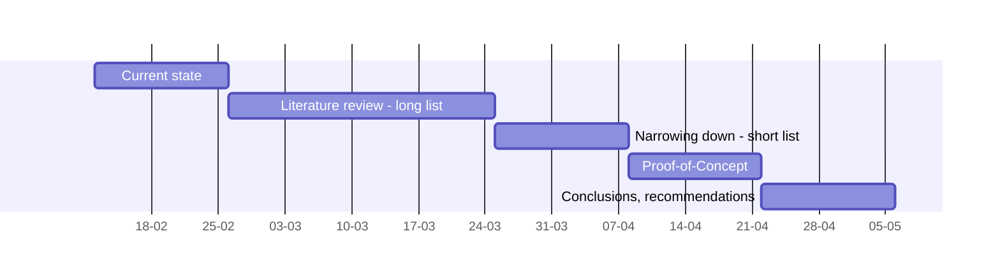

## Phase 5. Methodology

# Effectiveness of AI-Enabled Behavioral Analysis vs. Human Diagnosis in Depression Screening.

## Methodology

### Artur Nenakhov and Matthis Van Hoecke

E-mail: artur.nenakhov@student.hogent.be and matthis.vanhoecke@student.hogent.be 
Project repo: https://github.com/HoGentTIN/rm-2223-en-paper-rmnenakhovvanhoecke

The goal of this section is to describe how to conduct a comparative study that evaluates the effectiveness of AI-enabled behavioural analysis versus human diagnosis in depression screening. The authors will examine if AI analysis is more accurate than doctors through several phases, each with specific objectives and deliverables.

The first phase will be data collected by a swift literature review and provides a description of the current state of mental health screening and diagnosis for depressive disorder. The authors will determine the requirements for a perfect mental health screening and establish the criteria for evaluating the effectiveness between AI-enabled systems and human diagnosis. The existing methods will be reviewed and their difficulties and limitations will be identified. During 3 weeks the authors will deliver a description of the current situation related to depression diagnosis and a clearly defined set of requirements for the comparative study.

The second phase will cover the approaches and tools, considering both AI-enabled behavioural analysis and human diagnosis methods. Three weeks will be required to perform a deep literature review during this phase. The review can help to find already existing AI-based mental health screeners and machine learning frameworks that can be used as a base for those screeners. It can also provide an already tested accuracy comparison and conduct some ethical and security problems when using AI for mental health screening.

After acquiring a long list of tools and approaches the authors will spend 2 weeks narrowing it down and assess which will prove to be most effective for our research. As a result, the short list with "M" and "S" (according to the MoSCoW system) will create a base for the comparative study.

Proof-of-concept, the forth phase, which also takes 2 weeks, aims to show the effectiveness of the chosen AI-based approach for mental health screening. This phase involves developing a small-scale version of the suggested solution, collecting data from the assessments created by professionals and the chosen AI, reviewing the data, and applying appropriate statistical methods to evaluate the data.

The next phase covers the conclusion and future recommendations based on outcomes obtained during the Proof-of-concept, there can be 2 expected results: the AI-enabled system is more effective than professionals in depression screening, or vice versa. Regardless of the conclusion, future recommendations can suggest refining the AI algorithms and models to improve their performance and reduce false positive/negative answers or explore the potential benefits of combining AI analysis and the knowledge of mental health professionals will be benefitial to our society.

